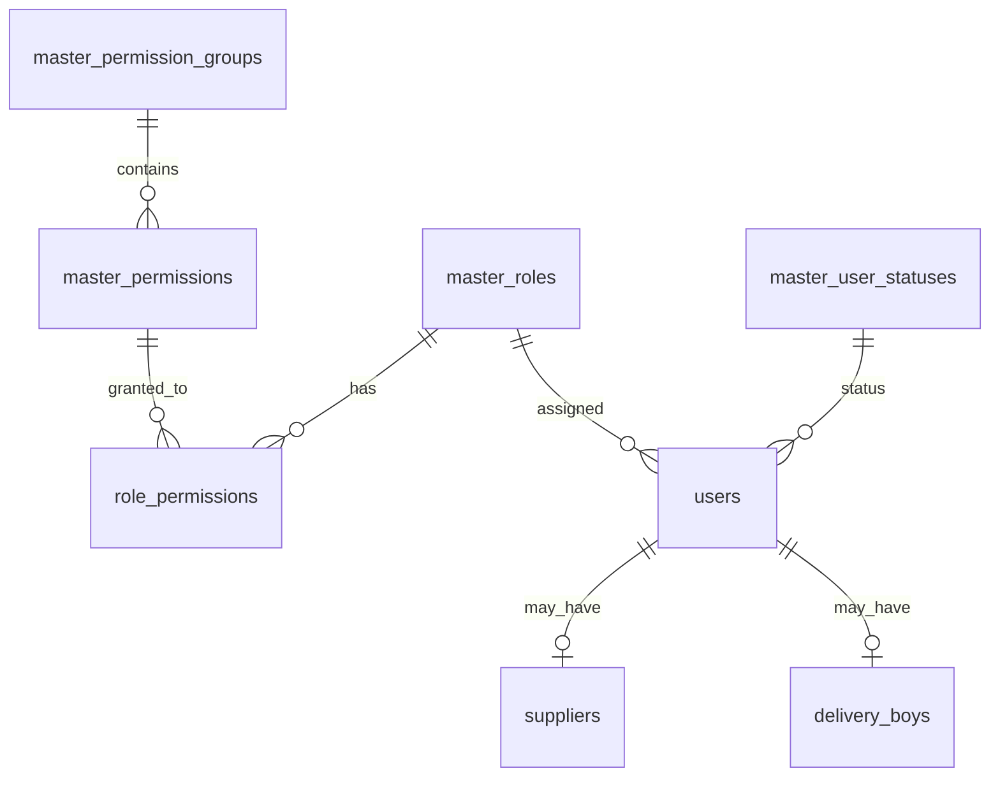

# DropMart Database — Table-wise Reference

Database: **PostgreSQL** (`Drop-Ship`)  
ORM: **Prisma** — schema at `apps/api/prisma/schema.prisma`

---

## Overview

| Category | Tables | Purpose |
|----------|--------|---------|
| RBAC Masters | 4 | Roles, permissions (rights), groups, role↔permission mapping |
| User Masters | 1 | User account statuses |
| Business Masters | 7 | Order, payment, supplier, product, delivery, category statuses |
| Core Users | 1 | Login accounts linked to role + status |
| Business | 12 | Suppliers, products, orders, delivery, notifications |

**Total: 25 tables**

---

## 1. RBAC Master Tables (Roles & Rights)

### `master_permission_groups`
Groups permissions into logical modules.

| Column | Type | Description |
|--------|------|-------------|
| id | String (cuid) | Primary key |
| code | String (unique) | e.g. `catalog`, `orders`, `users_access` |
| label | String | Display name |
| description | String? | What this group covers |
| sortOrder | Int | UI sort order |
| isActive | Boolean | Soft enable/disable |

**Seeded rows (7):** catalog, orders, payments, users_access, suppliers, analytics, delivery

---

### `master_roles`
Platform roles — who the user is.

| Column | Type | Description |
|--------|------|-------------|
| id | String (cuid) | Primary key |
| code | String (unique) | e.g. `superadmin`, `admin`, `supplier` |
| label | String | Display name |
| description | String? | Role purpose |
| sortOrder | Int | UI sort order |
| isActive | Boolean | Soft enable/disable |

**Seeded rows (9):**

| code | label | Description |
|------|-------|-------------|
| superadmin | Super Admin | Full platform access — all rights |
| admin | Admin | Platform operations manager |
| catalog_manager | Catalog Manager | Manages product catalog |
| order_manager | Order Manager | Processes customer orders |
| finance | Finance | Handles payments and refunds |
| support | Support | Customer support agent |
| delivery | Delivery Partner | Delivery boy / rider |
| supplier | Supplier | Verified product supplier |
| customer | Customer | Storefront buyer |

---

### `master_permissions`
Individual rights (what a role can do).

| Column | Type | Description |
|--------|------|-------------|
| id | String (cuid) | Primary key |
| code | String (unique) | e.g. `product:create`, `order:read` |
| label | String | Display name |
| description | String? | What this right allows |
| groupId | FK → master_permission_groups | Permission module |
| sortOrder | Int | Sort within group |
| isActive | Boolean | Soft enable/disable |

**Seeded rows (19):**

| code | label | Group |
|------|-------|-------|
| product:create | Create Products | catalog |
| product:read | View Products | catalog |
| product:update | Edit Products | catalog |
| product:delete | Delete Products | catalog |
| product:approve | Approve Products | catalog |
| order:read | View All Orders | orders |
| order:process | Process Orders | orders |
| order:read:own | View Own Orders | orders |
| payment:read | View Payments | payments |
| payment:refund | Issue Refunds | payments |
| user:manage | Manage Users | users_access |
| rbac:manage | Manage RBAC | users_access |
| platform:config | Platform Config | users_access |
| supplier:manage | Manage Suppliers | suppliers |
| supplier:read:own | View Own Supplier Data | suppliers |
| supplier:verify | Verify Suppliers | suppliers |
| analytics:read | View Analytics | analytics |
| delivery:track | Live Delivery Tracking | delivery |
| delivery:update | Update Delivery Location | delivery |

---

### `role_permissions`
Junction table — which role has which rights.

| Column | Type | Description |
|--------|------|-------------|
| id | String (cuid) | Primary key |
| roleId | FK → master_roles | Role |
| permissionId | FK → master_permissions | Permission |
| grantedAt | DateTime | When right was granted |
| grantedBy | String? | User ID who granted (optional) |

**Unique:** `(roleId, permissionId)`

**Role → Permissions mapping:**

| Role | Permissions |
|------|-------------|
| superadmin | All 19 permissions |
| admin | product:*, order:read, order:process, payment:*, user:manage, analytics:read, supplier:manage, supplier:verify |
| catalog_manager | product:create, product:read, product:update, product:delete, product:approve |
| order_manager | order:read, order:process, payment:read, supplier:read:own, product:read |
| finance | payment:read, payment:refund, analytics:read, order:read |
| support | order:read, product:read |
| delivery | delivery:track, delivery:update, order:read:own |
| supplier | product:create, product:read, product:update, supplier:read:own, order:read:own |
| customer | product:read, order:read:own |

---

## 2. User Master Table

### `master_user_statuses`
Account status for users (separate from supplier status).

| Column | Type | Description |
|--------|------|-------------|
| id | String (cuid) | Primary key |
| code | String (unique) | e.g. `active`, `suspended` |
| label | String | Display name |
| color | String? | Hex color for UI badges |
| sortOrder | Int | UI sort order |
| isActive | Boolean | Soft enable/disable |

**Seeded rows (4):**

| code | label | color |
|------|-------|-------|
| active | Active | #10b981 |
| inactive | Inactive | #6b7280 |
| suspended | Suspended | #ef4444 |
| pending_verification | Pending Verification | #f59e0b |

---

## 3. Users Table

### `users`
Login accounts — linked to **one role** and **one user status**.

| Column | Type | Description |
|--------|------|-------------|
| id | String (cuid) | Primary key |
| email | String (unique) | Login email |
| passwordHash | String | bcrypt hash |
| name | String | Full name |
| phone | String? | Phone number |
| avatar | String? | Profile image URL |
| roleId | FK → master_roles | User's role |
| statusId | FK → master_user_statuses | Account status |
| lastLoginAt | DateTime? | Last login timestamp |
| isActive | Boolean | Account enabled |
| createdAt | DateTime | Created |
| updatedAt | DateTime | Updated |

**Seeded demo users (10):**

| Email | Name | Role | Password |
|-------|------|------|----------|
| ashutoshkumarm416@gmail.com | Ashutosh Kumar | superadmin | Maddy8787 |
| rahul@dropmart.in | Rahul Mehta | admin | password123 |
| ananya@dropmart.in | Ananya Patel | catalog_manager | password123 |
| vikram@dropmart.in | Vikram Singh | order_manager | password123 |
| deepa@dropmart.in | Deepa Nair | finance | password123 |
| karan@dropmart.in | Karan Joshi | support | password123 |
| arjun@gmail.com | Arjun Kumar | customer | password123 |
| meera@supplier.in | Meera Traders | supplier | password123 |
| new@supplier.in | New Supplier Co | supplier | password123 |
| ravi@delivery.in | Ravi Delivery | delivery | password123 |

---

## 4. Other Master Tables

### `master_order_statuses`
| code | label | isFinal |
|------|-------|---------|
| pending | Pending | false |
| confirmed | Confirmed | false |
| processing | Processing | false |
| shipped | Shipped | false |
| delivered | Delivered | true |
| cancelled | Cancelled | true |
| refunded | Refunded | true |

### `master_payment_methods`
| code | label |
|------|-------|
| razorpay | Razorpay |
| stripe | Stripe |
| cod | Cash on Delivery |

### `master_payment_statuses`
| code | label |
|------|-------|
| paid | Paid |
| pending | Pending |
| refunded | Refunded |
| failed | Failed |

### `master_supplier_statuses`
| code | label |
|------|-------|
| pending_verification | Pending Verification |
| verified | Verified |
| rejected | Rejected |
| suspended | Suspended |

### `master_product_statuses`
| code | label |
|------|-------|
| draft | Draft |
| pending_approval | Pending Approval |
| approved | Approved |
| rejected | Rejected |

### `master_delivery_statuses`
| code | label |
|------|-------|
| assigned | Assigned |
| picked_up | Picked Up |
| in_transit | In Transit |
| nearby | Nearby |
| delivered | Delivered |

### `master_categories`
| slug | name |
|------|------|
| home-decor | Home Decor |
| kitchen | Kitchen |
| fitness | Fitness |
| electronics | Electronics |
| fashion | Fashion |
| beauty | Beauty |

### `platform_settings`
| key | value |
|-----|-------|
| site_name | DropMart |
| support_email | rainishu794@gmail.com |
| free_shipping_threshold | 999 |
| default_shipping_fee | 49 |
| currency | INR |

---

## 5. Business / Transactional Tables

| Table | Purpose | Key FKs |
|-------|---------|---------|
| suppliers | Supplier business profiles | userId → users, statusId → master_supplier_statuses |
| products | Product catalog | supplierId, categoryId, statusId |
| product_variants | Size/color variants | productId |
| orders | Customer orders | customerId, supplierId, statusId, paymentMethodId, paymentStatusId |
| order_items | Line items per order | orderId, productId |
| order_addresses | Delivery address | orderId |
| delivery_boys | Rider profiles | userId |
| delivery_assignments | Order ↔ rider mapping | orderId, deliveryBoyId, statusId |
| delivery_locations | GPS history for tracking | assignmentId |
| notifications | In-app + email alerts | userId |

---

## Entity Relationship (RBAC + Users)



---

## Seed File Structure

Seeds are split by table group under `apps/api/prisma/seeds/`:

| File | Tables seeded |
|------|---------------|
| `master-rbac.ts` | master_permission_groups, master_roles, master_permissions, role_permissions |
| `master-statuses.ts` | master_user_statuses, master_order_statuses, master_payment_*, master_supplier_statuses, master_product_statuses, master_delivery_statuses |
| `master-catalog.ts` | master_categories, platform_settings |
| `users.ts` | users |
| `business-data.ts` | suppliers, delivery_boys, products, orders, delivery_assignments |

Run: `cd apps/api && npm run prisma:seed`

---

## API — Masters Endpoint

`GET /api/v1/masters` returns all master data including:

- `roles` — all roles
- `permissionGroups` — permission modules
- `permissions` — all rights with group info
- `rbacMatrix` — role → permission codes
- `userStatuses` — user account statuses
- Plus order/payment/supplier/product/delivery statuses, categories, settings

---

## Commands

```bash
cd apps/api
npx prisma migrate dev      # Apply schema changes
npm run prisma:seed         # Seed all tables
npm run prisma:studio       # Browse data at :5555
npx prisma generate         # Regenerate client after schema change
```
